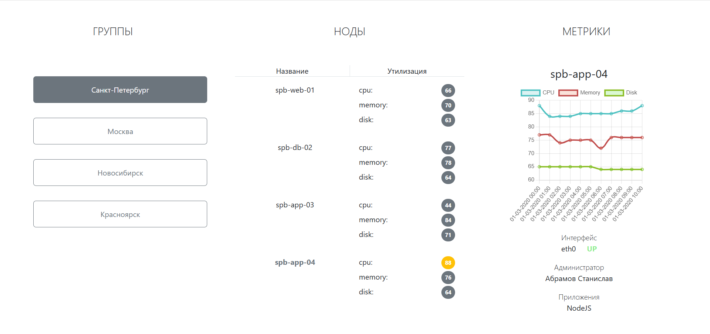

# infrastructure-dashboard

## Тестовое задание

Задача: реализовать представление, отображающее состояние инфраструктуры предприятия.

## Стэк

- Node.js v22
- React v19
- react-router-dom
- Bootstrap 5
- Webpack
- Axios
- ESlint

## Установка frontend

Склонируйте репозиторий: `git@github.com:Katteri/infrastructure-dashboard.git`

Перейдите в папку `infrastructure-dashboard/frontend`

Выполните команду `make install`.
```bash
$ git clone git@github.com:Katteri/infrastructure-dashboard.git
$ cd infrastructure-dashboard/frontend
$ make install
```

## Разработка

```bash
make develop
```

Frontend будет запущен на localhost:23400

## Запуск backend

Перейдите в папку `infrastructure-dashboard/backend`

Выполните команду `npm i`, далее выполните `npm run start`.

## Пример отображения frontend

